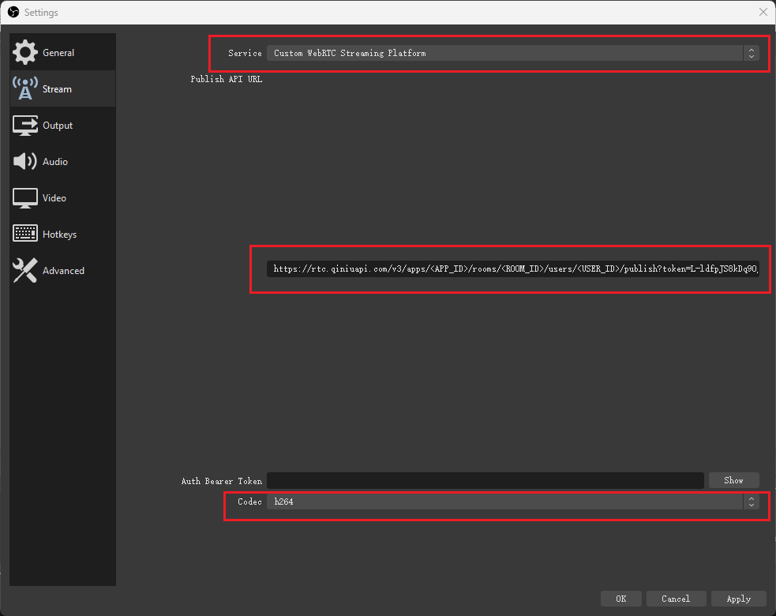

# 基于 OBS 通过 WHIP 接入 QRTC 网络

OBS 可以支持丰富的输入源并支持基本编排，使用基于 OBS 的方式通过 WHIP 协议向 QRTC 网络推流可以轻松将 OBS 的生产内容输入到实时互动场景中。

## OBS 推流步骤

### Step 1 创建 七牛云-实时音视频 应用

参考 [https://developer.qiniu.com/rtc/10155/process](https://developer.qiniu.com/rtc/10155/process)

### Step 3 获取 Token

参考 [https://developer.qiniu.com/rtc/8813/roomToken](https://developer.qiniu.com/rtc/8813/roomToken)

### Step 3 通过 OBS 推流

下载并安装 OBS-WebRTC

- [https://demo-qnrtc-files.qnsdk.com/obs-webrtc-x64-23.2.84.rc4.msi](https://demo-qnrtc-files.qnsdk.com/obs-webrtc-x64-23.2.84.rc4.msi)

当前仅支持 Windows 环境

进入 OBS 设置界面

- Service // 选择 `Custom WebRTC Streaming Platform`
- Publish API URL // 填入推流地址
- Codec // 选择 `h264`

参考下图所示：



推流地址格式如下：

```
https://rtc.qiniuapi.com/v3/apps/<APP_ID>/rooms/<ROOM_ID>/users/<USER_ID>/publish?token=<ROOM_TOKEN>
```

其中：

- <APP_ID> // 为 Step 1 中创建的 APP_ID
- <ROOM_ID> // 为房间名称
- <USER_ID> // 为房间内用户名称
- <ROOM_TOKEN> // 为 Step 2 中签算的 Token
